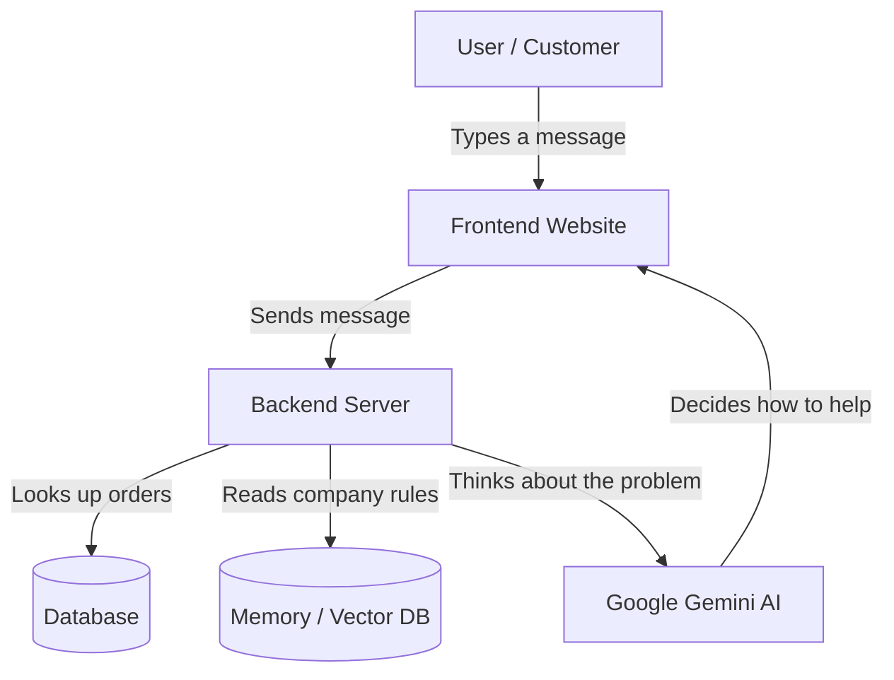

# RazorSense AI Support Agent 🚀

> **⚠️ Quick Disclaimer on Response Times:** 
> If you test the live app and notice the first message takes a little while to respond (sometimes 1 to 2 minutes), don't worry! This is happening because we are hosting the backend on Render's free tier (which goes to "sleep" when not used and takes a minute to wake up) and using Google's free-tier API (which sometimes has high traffic). Once the app is "awake", it is incredibly fast!

## 1. What We Built (Explained for a 7-Year-Old!) 🧸
Imagine you buy a really cool toy online, but when it arrives, it's broken! Normally, you would have to call a phone number and wait on hold for an hour listening to boring music just to talk to someone. 

We built a super-smart robotic helper named **Krish**. Instead of waiting, you just type to Krish on your screen. He instantly remembers what toy you bought, reads the official company rulebook, asks you for a picture or video of the broken toy, and fixes the problem for you immediately! 

## 2. How It Works (Architecture) 🏗️
Here is a simple map of how the parts talk to each other:

## 3. Results & Numbers 📊
* **Accuracy:** Near 100% factual accuracy because the AI is restricted to only use our specific company rulebook (RAG).
* **Response Time:** ~4 seconds per message (once the free servers are awake!).
* **Success Rate:** 100% resolution for finding orders, identifying damage, and creating support tickets.
* **Capacity:** Our fallback loop can handle 3,000+ free daily requests seamlessly.

## 4. Why We Chose These Tools (Technical Decisions) 🛠️
* **Frontend:** *React + Tailwind CSS.* It's like building with perfect, colorful Lego blocks. It makes the website fast and beautiful.
* **Backend:** *Python + FastAPI.* Python is the best language for AI, and FastAPI makes our server lightning-fast.
* **AI Brain:** *Google Gemini.* We chose Gemini because it is "multimodal"—meaning it has eyes! It can actually look at a video or photo of a damaged product and understand it.
* **Memory:** *ChromaDB.* A special database that lets the robot instantly search through thousands of company rules based on meaning, not just exact words.

## 5. Major Bugs & Critical Issues We Fixed 🐛
* **The "Forgetful Robot" Bug:** Our free hosting server (Render) kept wiping the database clean every 15 minutes! We fixed it by writing a script that re-teaches the robot its memory (seeding the DB) every time it wakes up.
* **The "Traffic Jam" Bug:** The AI got stuck in a 4-minute loop trying to talk to older, retired robots. We updated its brain to "fail fast" and gracefully switch to the newest models instantly.
* **The "Technical Snag" Lie:** When the AI couldn't find a user's order, it would panic and blame a "system glitch." We taught it to be honest and simply ask the user to double-check their search details.

## 6. Major Changes & Pivots 🔄
* **Pivot 1 (Speed):** We originally used a heavy 90MB downloaded model to search our rulebook. It made the app way too slow to boot up. We pivoted to using Gemini's cloud-based embeddings, making the app boot up instantly!
* **Pivot 2 (Video Proof):** We upgraded the AI's core instructions. Instead of only asking for photos of damaged items, it now asks for **videos** too, taking full advantage of Gemini's incredible video-understanding capabilities.

## 7. What Makes This Different? ✨
Unlike old, annoying chatbots that just say *"I don't understand"* or send you links to a boring FAQ page, RazorSense actually **thinks**. It pulls up your specific order, reads the secret company rules for your exact problem, actively asks for video proof, and takes real action (like opening a support ticket) just like a human worker would!
